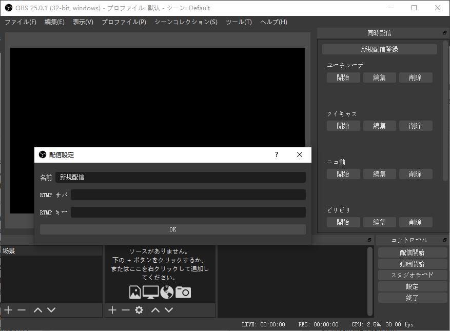

一生懸命に日本語で書いてみます＞＜

# OBS 同時配信プラグイン

本プラグインは、複数サイトに同時配信のため作ったものです。

# ダウンロード

[リリースページへ](https://github.com/sorayuki/obs-multi-rtmp/releases/)

# スクリーンショット

# 要求環境

OBS-Studio バージョン 25.0.0 以降
また、OBS-Studio 本体は QT 5.10.1 と共にビルドしたバージョン

確認済：
obs-studio 25.0.1 ~ obs-studio 25.0.3

# よくあるご質問

**Q: どうして OBS 25.0 以降じゃなくてダメなの？**

A: 古いバージョンの RTMP 配信モジュールはスレッドセーフじゃないため、複数配信の時クラッシュする可能性があります。

詳しいはこのコミットに参照してください: 

https://github.com/obsproject/obs-studio/commit/2b131d212fc0e5a6cd095b502072ddbedc54ab52 

**Q: どうして OBS 本体が配信したことない時このプラグインは使えないでしょうか？**

A: このプラグインは OBS 本体のエンコーダーと共有している。しかし、OBS は初めての配信を開始した前エンコーダーの作成しない。

# How to Build

1. Prepare environment
   1. Put official release OBS 25.0 into obs-bin directory. 
   2. Extract OBS source code of same version as binary to obs-src
   3. Download Qt that obs-bin uses. Which can be found in CI\install-qt-win.cmd

2. Configure
   Use cmake to configure this project. must use VS2017 or higher. 
   cmake's QTDIR variable is set to the path of QT in the same version as obs uses. 
   
   Set CMAKE_BUILD_TYPE to Release. 

   > Notice: debug version of this plugin only works with debug version of OBS, which means you must build OBS from source.

3. Compile

