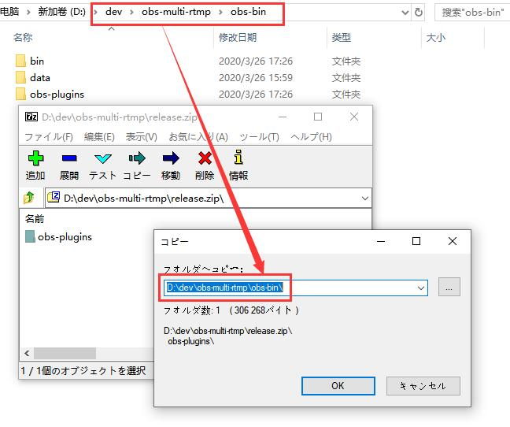

<!-- Global site tag (gtag.js) - Google Analytics -->

一生懸命に日本語で書いてみます＞＜

# OBS 同時配信プラグイン

本プラグインは、複数サイトに同時配信のため作ったものです。

# ダウンロード

[リリースページへ](https://github.com/sorayuki/obs-multi-rtmp/releases/)

# インストール手順

zipファイルを OBS のフォルダーに解凍してインストール完了。

# スクリーンショット

# 要求環境

OBS-Studio バージョン 25.0.0 以降
また、OBS-Studio 本体は QT 5.10.1 と共にビルドしたバージョン

確認済：
obs-studio 25.0.1 ~ obs-studio 25.0.3

# よくあるご質問

**Q: どうして OBS 25.0 以降じゃなくてダメなの？**

A: 古いバージョンの RTMP 配信モジュールはスレッドセーフじゃないため、複数配信の時クラッシュする可能性があります。

詳しいはこのコミットに参照してください: 

https://github.com/obsproject/obs-studio/commit/2b131d212fc0e5a6cd095b502072ddbedc54ab52 

**Q: どうして OBS 本体が配信したことない時このプラグインは使えないでしょうか？**

A: このプラグインは OBS 本体のエンコーダーと共有している。しかし、OBS は初めての配信を開始した前エンコーダーの作成しない。

# How to Build

1. Prepare environment
   1. Put official release OBS 25.0 into obs-bin directory. 
   2. Extract OBS source code of same version as binary to obs-src
   3. Download Qt that obs-bin uses. Which can be found in CI\install-qt-win.cmd

2. Configure
   Use cmake to configure this project. must use VS2017 or higher. 
   cmake's QTDIR variable is set to the path of QT in the same version as obs uses. 
   
   Set CMAKE_BUILD_TYPE to Release. 

   > Notice: debug version of this plugin only works with debug version of OBS, which means you must build OBS from source.

3. Compile

# 捐赠 / 投げ銭 / donate

如果你觉得这个工具很有用想要捐赠，这里是链接。注意：这不是提需求的渠道。

このツールに投げ銭したいならここはリンクです。（機能要求ではありません）

If you regard this tool useful and want to doante for some, here is the link. (It's not for feature request.)

## paypal / 贝宝

<form action="https://www.paypal.com/cgi-bin/webscr" method="post" target="_top">
<input type="hidden" name="cmd" value="_s-xclick">
<table>
<tr><td><input type="hidden" name="on0" value="superchat">superchat</td></tr><tr><td><select name="os0">
	<option value="donate">donate $ 1.00 USD</option>
	<option value="donate">donate $ 5.00 USD</option>
	<option value="donate">donate $ 10.00 USD</option>
	<option value="donate">donate $ 15.00 USD</option>
</select> </td></tr>
<tr><td><input type="hidden" name="on1" value="text">text</td></tr><tr><td><input type="text" name="os1" maxlength="200"></td></tr>
</table>
<input type="hidden" name="encrypted" value="-----BEGIN PKCS7-----MIIIEQYJKoZIhvcNAQcEoIIIAjCCB/4CAQExggEwMIIBLAIBADCBlDCBjjELMAkGA1UEBhMCVVMxCzAJBgNVBAgTAkNBMRYwFAYDVQQHEw1Nb3VudGFpbiBWaWV3MRQwEgYDVQQKEwtQYXlQYWwgSW5jLjETMBEGA1UECxQKbGl2ZV9jZXJ0czERMA8GA1UEAxQIbGl2ZV9hcGkxHDAaBgkqhkiG9w0BCQEWDXJlQHBheXBhbC5jb20CAQAwDQYJKoZIhvcNAQEBBQAEgYCtO4LPaw08THuKHc6UuFKo9s4/KvDH96O6P+o5g1nYK4I5eAYqesFbK0mjMwzIqa3k9VT/CKzQf6RBYaf0xEqVVT5AJhUyRaLzThCaahos0QFFnJUuJTwRDMnTmGMunUMhp8W4uEYbmhc7e3YChIpey3mDfQhG2zReC17zzqIvEjELMAkGBSsOAwIaBQAwggGNBgkqhkiG9w0BBwEwFAYIKoZIhvcNAwcECHbFOQIuEpCygIIBaNmcSMpzbf1emQJKi7VbzM+Kv/TjnM8eTERxWz9bHy0nq7S9wLWIwNYzHtPshWlLFAst5W5McuVFe02Ai84bfzB+DILXTJ+k0m//qPbM90VfDk6SMf1kJ80seI0x5myAqwkSekceTAcaYwvlSIiQ6QLsTIE2Nklakd+W+tXttaRnek8AUyHoZdj5V0LHdnky4YKGxhf5/CMOxkQWMkyhVVMYmHrfl4qq5TUMSy/0lMDCPKhjkkYyCjEsVzwPsbwir72XWGyoadjBusjmBBF7V1dHNPNQoW9VNZjzcicQrRnrXu5K1oMRGtm8ndCuj4kns2MTG8j6VGVdwzfiRMSEzE5sys/Ven8iNVqwfgPhA5H28qsogSwsWUaWJaZFVIYBqwYsE+D/zOhT6CPT535WSfODzZ4Ep5kyUMsK0076Y+cGCZYQFqcGfvi6plSO9T6+xy4QevMPNpnxNOQWS5IiMqFsIVHI/kDQT6CCA4cwggODMIIC7KADAgECAgEAMA0GCSqGSIb3DQEBBQUAMIGOMQswCQYDVQQGEwJVUzELMAkGA1UECBMCQ0ExFjAUBgNVBAcTDU1vdW50YWluIFZpZXcxFDASBgNVBAoTC1BheVBhbCBJbmMuMRMwEQYDVQQLFApsaXZlX2NlcnRzMREwDwYDVQQDFAhsaXZlX2FwaTEcMBoGCSqGSIb3DQEJARYNcmVAcGF5cGFsLmNvbTAeFw0wNDAyMTMxMDEzMTVaFw0zNTAyMTMxMDEzMTVaMIGOMQswCQYDVQQGEwJVUzELMAkGA1UECBMCQ0ExFjAUBgNVBAcTDU1vdW50YWluIFZpZXcxFDASBgNVBAoTC1BheVBhbCBJbmMuMRMwEQYDVQQLFApsaXZlX2NlcnRzMREwDwYDVQQDFAhsaXZlX2FwaTEcMBoGCSqGSIb3DQEJARYNcmVAcGF5cGFsLmNvbTCBnzANBgkqhkiG9w0BAQEFAAOBjQAwgYkCgYEAwUdO3fxEzEtcnI7ZKZL412XvZPugoni7i7D7prCe0AtaHTc97CYgm7NsAtJyxNLixmhLV8pyIEaiHXWAh8fPKW+R017+EmXrr9EaquPmsVvTywAAE1PMNOKqo2kl4Gxiz9zZqIajOm1fZGWcGS0f5JQ2kBqNbvbg2/Za+GJ/qwUCAwEAAaOB7jCB6zAdBgNVHQ4EFgQUlp98u8ZvF71ZP1LXChvsENZklGswgbsGA1UdIwSBszCBsIAUlp98u8ZvF71ZP1LXChvsENZklGuhgZSkgZEwgY4xCzAJBgNVBAYTAlVTMQswCQYDVQQIEwJDQTEWMBQGA1UEBxMNTW91bnRhaW4gVmlldzEUMBIGA1UEChMLUGF5UGFsIEluYy4xEzARBgNVBAsUCmxpdmVfY2VydHMxETAPBgNVBAMUCGxpdmVfYXBpMRwwGgYJKoZIhvcNAQkBFg1yZUBwYXlwYWwuY29tggEAMAwGA1UdEwQFMAMBAf8wDQYJKoZIhvcNAQEFBQADgYEAgV86VpqAWuXvX6Oro4qJ1tYVIT5DgWpE692Ag422H7yRIr/9j/iKG4Thia/Oflx4TdL+IFJBAyPK9v6zZNZtBgPBynXb048hsP16l2vi0k5Q2JKiPDsEfBhGI+HnxLXEaUWAcVfCsQFvd2A1sxRr67ip5y2wwBelUecP3AjJ+YcxggGaMIIBlgIBATCBlDCBjjELMAkGA1UEBhMCVVMxCzAJBgNVBAgTAkNBMRYwFAYDVQQHEw1Nb3VudGFpbiBWaWV3MRQwEgYDVQQKEwtQYXlQYWwgSW5jLjETMBEGA1UECxQKbGl2ZV9jZXJ0czERMA8GA1UEAxQIbGl2ZV9hcGkxHDAaBgkqhkiG9w0BCQEWDXJlQHBheXBhbC5jb20CAQAwCQYFKw4DAhoFAKBdMBgGCSqGSIb3DQEJAzELBgkqhkiG9w0BBwEwHAYJKoZIhvcNAQkFMQ8XDTIwMTExNTA2MzI0NVowIwYJKoZIhvcNAQkEMRYEFCAXlG3HnVQsH+jwVTjY6Lw+HJAfMA0GCSqGSIb3DQEBAQUABIGAT90ouTVkDhXGJsItjGEWN4CXtyTBmOapl4z86yt1nEbG/DgkTjX2si1n3Kp1y+fqS6Vfb6UqnqzyYSNvggB4wxceajM3YSP0flTXI+TalQ8OhP83fqt/dno1oU/R4EpQIMpb/9NfhnlNrI8SNSRctbTNznvD3cFvE2Bu8VywSbs=-----END PKCS7-----">
<input type="image" src="https://www.paypalobjects.com/en_US/i/btn/btn_buynowCC_LG.gif" border="0" name="submit" alt="PayPal - The safer, easier way to pay online!">

</form>

## alipay or wechat / 支付宝或微信

